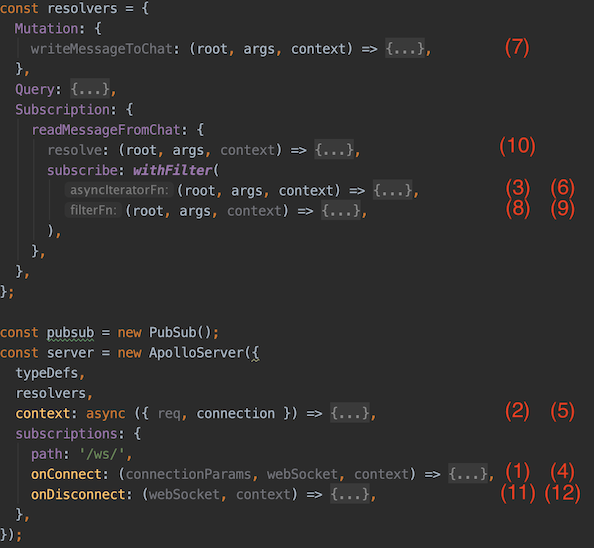
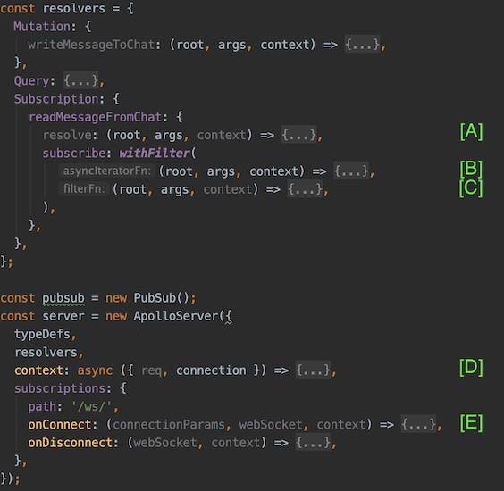

# GraphQL subscriptions auth (authentication and authorization)
Simple application, which allow to subscribe to receive messages from a chat and send a message via mutation. 
The app shows a subscription life cycle in Apollo.

## Installation

```bash
git clone git@github.com:viktor-br/gql-subscriptions-auth.git
```
switch to `gql-subscriptions-auth` folder
```bash
npm install
```

## Structure of the project
_server.js_ provides primitive API for messenger with multiple chats. Messages could be sent or received from by chatId. 

```graphql
  type Message {
    id: Int!
    chatId: Int!
    content: String!
  }

  type Query {
    readMessageById(id: Int!): Message!
  }

  type Mutation {
    writeMessageToChat(chatId: Int!, content: String!): Message
  }

  type Subscription {
    readMessageFromChat(chatId: Int!): Message!
  }
```

_client-subscribe.js_ subscribes to readMessageFromChat to receive message from chat (by default subscribes to chatId=1):
```bash
node client-subscribe.js 2
```

_client-send-message.js_ send message to server with using _writeMessageToChat_ mutation for a particular chatId (by default send for chatId=1):
```bash
node client-send-message.js 2
```

## Playing with subscriptions
Follow next steps to trigger each step of subscription life cycle:
* run server.js
    ```bash
    node server.js
    ```
* run subscription for chatId=1
    ```bash
    node client-subscribe.js 1
    ```
* run subscription for chatId=2
    ```bash
    node client-subscribe.js 2
    ```
* send message to chatId=2
    ```bash
    node client-send-message.js 2
    ```
* check in logs that only second subscription received message  
    ```
    21:00:51 subscription:readMessageFromChat chatId=2 { data:
        { readMessageFromChat: { id: 12345, content: '123456789', __typename: 'Message' } } }
    ```
* exit from subscription for chatId=1 (press Ctrl+C)
* exit from subscription for chatId=2 (press Ctrl+C)

as a result of previous steps, you'll receive something like log below:
```text
 1. 21:00:41 subscriptions:onConnect                                            
 2. 21:00:41 subscription:readMessageFromChatResolver:subscribe() asyncIterator
 3. 21:00:45 subscriptions:onConnect                                            
 4. 21:00:45 subscription:readMessageFromChatResolver:subscribe() asyncIterator
 5. 21:00:51 mutation:writeMessageToChat:resolve()                              
 6. 21:00:51 subscription:readMessageFromChatResolver:subscribe() filter 1 2                                     
 7. 21:00:51 subscription:readMessageFromChatResolver:subscribe() filter 2 2    
 8. 21:00:51 subscription:readMessageFromChatResolver:resolve() 2               
 9. 21:01:02 subscriptions:onDisconnect                                         
10. 21:01:04 subscriptions:onDisconnect                                         
```
Next image shows order of calls and red markers are numbers of the server.js log lines. 



The subscription life cycle is simple: 
* onConnect (markers 1 and 3), when client tries to open websocket connection 
* asyncIteratorFn (markers 2 and 4), when client tries to create subscription
* filterFn (markers 6 and 7), when messages comes via pubsub
* resolve (marker 8), if subscription for a particular chat matched a message
* onDisconnect (marker 9 and 10), when client closes connection

## Authentication and Authorization
Image below is a *server.js* code with markers for possible places with usage of authentication and authorization. 



Apollo documentation has an example of authentication over webSocket [https://www.apollographql.com/docs/apollo-server/data/subscriptions/#authentication-over-websocket](https://www.apollographql.com/docs/apollo-server/data/subscriptions/#authentication-over-websocket)
in onConnect method (marked with letter E).
In case you has unified authentication for query/mutation and subscription, you can place authentication logic in context creation (marked with letter D).

Authorization could be always a part of authentication, but could be separated. Websocket connection could be long-lived, but user permissions not.
We can put authorization logic in asyncIteratorFn (marked with letter B) and check permissions when create subscription, but it also could be
long lived, it exists till client unsubscribe (or server shutdown for sure). Next place is a filterFn (marked with letter C), but this function will be called for each
subscription, which means we need to check permissions for all connected users and definitely waste resources.
Last point is a resolver itself (marked with letter A), which will be called when all subscriptions for particular chat id filtered out.


